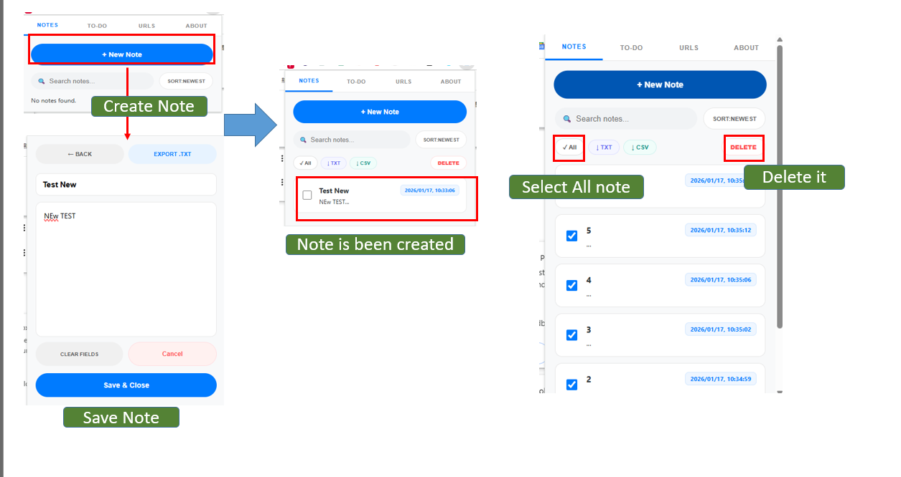
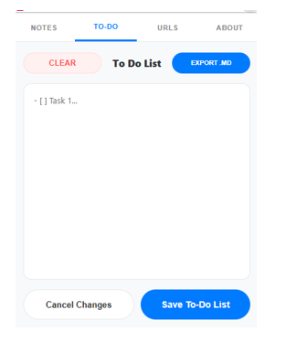
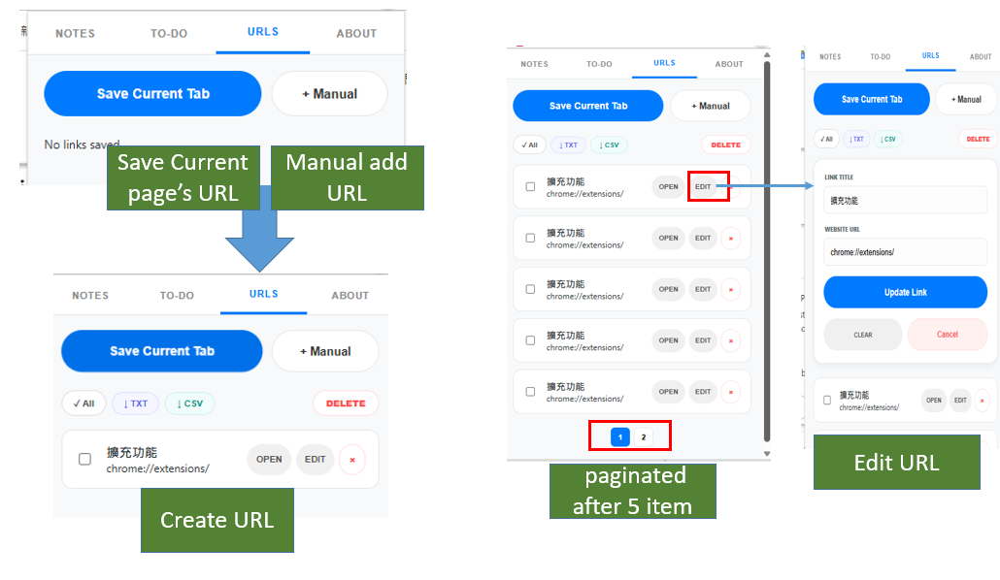

# Quick Note & URL Tracker (Chrome Extension)

  <a href="#english">English</a> | 
  <a href="#中文繁體">中文（繁體）</a>

---

## English

### Overview
Quick Note & URL Tracker is a lightweight Chrome extension that helps you quickly save **Notes**, manage a **To-Do list**, and store useful **URLs** in one place.

✅ **Cross-device Sync (Chrome Sync)**  
If you’re signed into the same Chrome profile and **Chrome Sync is enabled**, your notes/URLs/to-do can sync across your devices.

### Features

#### Notes
- Create and edit notes
- Save with one click (Save & Close)
- Search notes
- Sort notes (Newest / Alphabetical)
- Bulk actions: Select All, Export (TXT/CSV), Delete
- Export:
  - Export a **single note** as **TXT**
  - Export **multiple notes** as **TXT** or **CSV**

#### To-Do
- Write and manage a to-do list
- Save / cancel changes
- Export to-do list as **Markdown (.md)**
- Clear the entire list

#### URLs
- Save the **current tab** URL (title + link)
- Add URLs **manually**
- Edit / delete saved URLs
- Bulk actions: Select All, Export (TXT/CSV), Delete
- Pagination: automatically paginates when more than 5 URLs are saved
- Open saved URLs in a new tab

#### Popup + Side Panel
- Works as a popup (extension icon)
- Can also be opened in Chrome’s side panel (if enabled)

---

### Cross-device Sync (How it works)
This extension uses **Chrome Storage Sync**:

- If **Chrome Sync is ON**, your data can sync to other devices using the same Chrome profile.
- If **Chrome Sync is OFF**, the data stays only on that computer.

Requirements:
1. Log into the **same Google account / Chrome profile** on both devices
2. Enable **Chrome Sync** (and allow syncing extension data)

Notes:
- Sync is handled by Chrome and may not be instant.
- Some managed/work computers may block sync by policy.

---

### Storage Limits (Important)
Chrome storage has quotas, so there **is** a practical limit to how many notes you can save.

#### Sync storage (`chrome.storage.sync`)
- Total storage is about **~100 KB**
- Each single stored item has a limit of about **~8 KB**
- This extension uses “chunking” internally to avoid the per-item limit problem,
  but the **total ~100 KB sync limit still applies**.

✅ Best for: syncing small-to-medium notes across devices  
⚠️ If you store a lot of long notes, you may eventually hit the sync quota.

#### Local storage (`chrome.storage.local`)
- Local storage is about **~10 MB** (older Chrome was ~5 MB)
- Not synced to other devices
- Better if you want larger storage and don’t need cloud sync

✅ Best for: larger data, offline/local-only usage

Recommended approach:
- If you need cross-device: use Sync + keep notes reasonably sized
- If you need lots of storage: use Local + Export backups (TXT/CSV/MD)

---

### How to Install (Developer Mode)
1. Download or unzip the extension folder
2. Open Chrome and go to: `chrome://extensions`
3. Enable **Developer mode**
4. Click **Load unpacked**
5. Select the extension folder
6. (Optional) Pin the extension icon to the toolbar

---

### How to Use
- Click the extension icon to open the popup
- Use the top navigation tabs:
  - **NOTES**: Manage notes
  - **TO-DO**: Manage to-do list
  - **URLS**: Save and manage URLs
  - **ABOUT**: Extension information

---

### Export
- Notes can be exported as **TXT** or **CSV**
- URLs can be exported as **TXT** or **CSV**
- To-do list can be exported as **Markdown (.md)**

---

### Privacy
- This extension does **not** send your data to any custom server.
- Data is stored using Chrome’s storage system:
  - **Sync** (if enabled) stores data in your Chrome sync profile
  - Otherwise it stays **local** on your device
- Do not store highly sensitive secrets (this is not encrypted secure storage).

---

### Screenshot Output
- Add Note  

- Add To Do list  

- Add URL  

---

## 中文（繁體）

### 簡介
Quick Note & URL Tracker 是一個輕量級的 Chrome 擴充功能，協助你快速儲存 **筆記（Notes）**、管理 **待辦事項（To-Do）**，並集中保存常用 **網址（URLs）**。

✅ **跨裝置同步（Chrome Sync）**  
只要兩台電腦都登入同一個 Chrome 帳號，並開啟 Chrome 同步，就能同步筆記 / 網址 / 待辦清單。

### 功能

#### 筆記 Notes
- 新增與編輯筆記
- 一鍵儲存並關閉（Save & Close）
- 搜尋筆記
- 排序（最新 / 依字母）
- 批次功能：全選、匯出（TXT/CSV）、刪除
- 匯出：
  - 單筆筆記匯出 **TXT**
  - 多筆筆記匯出 **TXT / CSV**

#### 待辦事項 To-Do
- 新增與管理待辦清單
- 儲存 / 取消變更
- 匯出為 **Markdown（.md）**
- 一鍵清空待辦清單

#### 網址 URLs
- 儲存目前分頁（標題 + URL）
- 手動新增網址
- 編輯 / 刪除網址
- 批次功能：全選、匯出（TXT/CSV）、刪除
- 超過 5 筆自動分頁
- 一鍵開啟網址（新分頁）

#### Popup + Side Panel
- 可用於擴充功能彈出視窗（點圖示）
- 也可在 Chrome 側邊欄顯示（若啟用）

---

### 跨裝置同步（運作方式）
本擴充功能使用 **Chrome Storage Sync**：

- 若 Chrome 同步已開啟：可同步到同帳號的其他裝置
- 若 Chrome 同步關閉：資料只會存在本機

同步需求：
1. 兩台電腦登入同一個 Chrome 帳號 / Profile
2. 開啟 Chrome Sync（並允許同步擴充功能資料）

---

### 儲存限制（重要）
Chrome Storage 有容量限制，因此筆記數量（取決於內容長度）確實會有上限。

#### 同步儲存 Sync（chrome.storage.sync）
- 總容量約 **~100 KB**
- 單一項目約 **~8 KB** 限制
- 本專案使用分段儲存（chunking）避免單項超限，但 **總容量限制仍存在**

#### 本機儲存 Local（chrome.storage.local）
- 本機容量約 **~10 MB**（舊版 Chrome 約 ~5 MB）
- 不會同步到其他裝置
- 適合存更多、更長的內容

建議：
- 想跨裝置：使用 Sync，並避免存太長內容
- 想存很多：使用 Local，並定期匯出備份

---

### 安裝方式（開發者模式）
1. 下載或解壓縮擴充功能資料夾
2. 開啟 Chrome，前往：`chrome://extensions`
3. 開啟右上角 **開發人員模式（Developer mode）**
4. 點擊 **載入未封裝項目（Load unpacked）**
5. 選擇擴充功能資料夾
6.（選用）釘選擴充功能至工具列

---

### 隱私權說明
- 本擴充功能不會把資料上傳到任何自建伺服器
- 資料會儲存在 Chrome Storage：
  - 同步開啟時：跟著 Chrome Sync 同步到同帳號裝置
  - 同步關閉時：只留在本機
- 不建議用來存放高度敏感資訊（不是加密保險庫）。

---

### 截圖
- 筆記 Notes  

- 待辦事項 To-Do  

- 網址 URLs  

