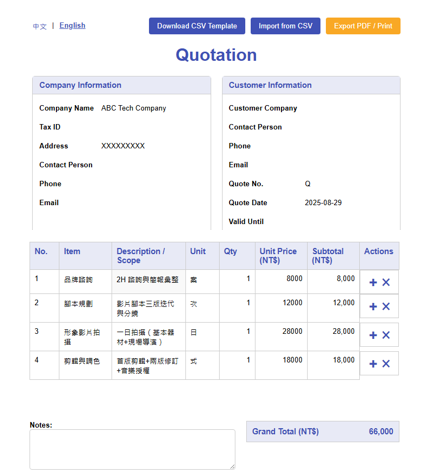

# Quotation 估價單系統 PRD 文件
- inital 2025.08.23 AI上課筆記

## AI TOOL:
- chatgpt
- Google AI studio

## Step

- Step1 discuss with chatgpt to create prd document 
- Step2 it will generate md file
- Step3 access google ai studio, attached md file, and tell it to convert to html file
prompt:`幫我製作成 html file` or `output.PNG`
- Step4 done, use netify to host it

## output

