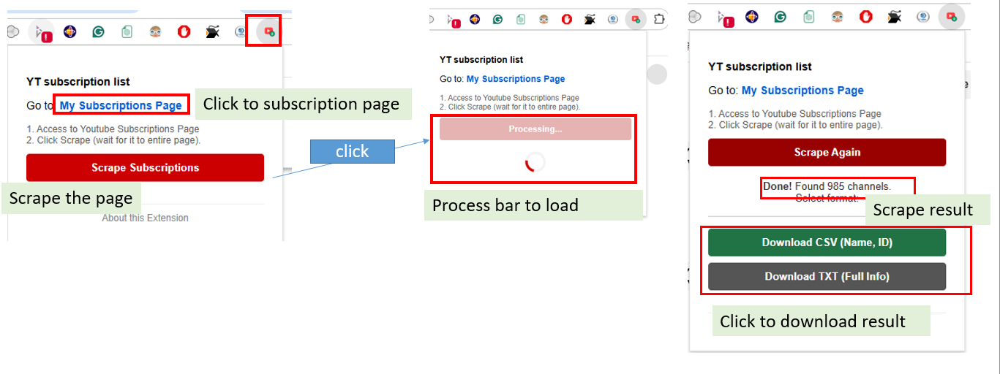
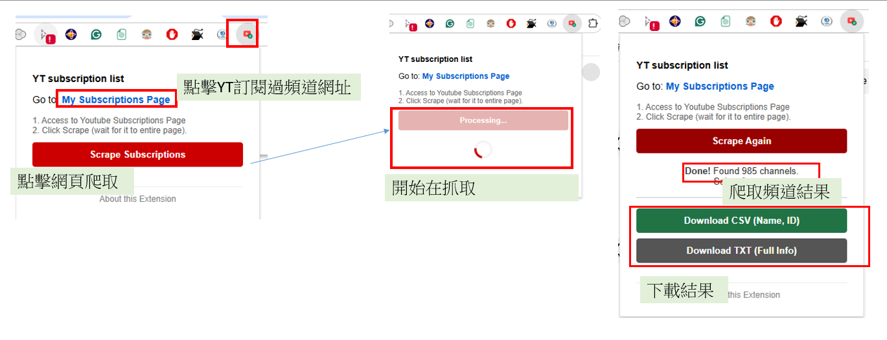

# YT Subscription List / YouTube 訂閱清單匯出工具

<!-- Language Navigation / 語言導覽 -->

  <strong>
    <a href="#-english">🇬🇧 English</a>
    &nbsp;&nbsp;|&nbsp;&nbsp;
    <a href="#-繁體中文">🇹🇼 繁體中文</a>
  </strong>

---

## 🇬🇧 English

### Description
A simple Google Chrome Extension that scrapes your YouTube subscriptions list and exports the data to **CSV** (for Excel) or **Text** file.

### Features
*   **Quick Link:** One-click link to open your `My Subscriptions` page.
*   **Visual Feedback:** Loading spinner shows when the extension is working.
*   **Export to CSV:** Saves **Channel Name** and **Channel ID (@Handle)**.
    *   *Includes UTF-8 BOM encoding so Chinese characters look correct in Excel.*
*   **Export to TXT:** Saves **Channel Name**, **ID**, and **Channel Intro/Description**.

### Installation
1.  Download this project or create a folder (e.g., `youtube-sub-scraper`) containing the source files (`manifest.json`, `popup.html`, `popup.js`, `content.js`).
2.  Open Google Chrome and go to `chrome://extensions`.
3.  Enable **"Developer mode"** (switch in the top right corner).
4.  Click **"Load unpacked"** (button in top left).
5.  Select your `youtube-sub-scraper` folder.

### How to Use
1.  Click the **Extension Icon** (Puzzle piece) in Chrome.
2.  Click the blue link: **"My Subscriptions Page"**. This opens a new tab.
3.  **IMPORTANT:** Scroll down manually to the very bottom of the YouTube page.
    *   *YouTube uses "lazy loading". You must scroll until the loading spinner stops to ensure all channels are loaded into memory.*
4.  Click the Extension Icon again.
5.  Click the Red Button: **"Scrape Subscriptions"**.
    *   *A spinner will appear while it processes.*
6.  Once finished, choose your format:
    - Download CSV:** Name & ID (Best for Excel).
    - Download TXT:** Name, ID & Intro.

### ScreenShot

 
 

---

## 🇹🇼 繁體中文

### 簡介
這是一個簡單的 Google Chrome 擴充功能，可以抓取您的 YouTube 訂閱清單，並將資料匯出為 **CSV** (Excel 用) 或 **文字檔 (TXT)**。

### 功能特色
*   **快速連結**：提供連結一鍵開啟「我的訂閱內容」頁面。
*   **視覺回饋**：執行時會顯示載入動畫，讓您知道程式正在運作。
*   **匯出 CSV**：儲存 **頻道名稱** 與 **頻道 ID (@Handle)**。
    *   *內建 UTF-8 BOM 編碼，確保在 Excel 中開啟時中文不會變亂碼。*
*   **匯出 TXT**：儲存 **頻道名稱**、**ID** 以及 **頻道簡介 (Intro)**。

### 安裝教學
1.  下載本專案或建立一個資料夾 (例如 `youtube-sub-scraper`)，並放入原始碼檔案 (`manifest.json`, `popup.html`, `popup.js`, `content.js`)。
2.  開啟 Google Chrome 瀏覽器，在網址列輸入 `chrome://extensions`。
3.  開啟右上角的 **「開發人員模式」 (Developer mode)** 開關。
4.  點擊左上角的 **「載入未封裝項目」 (Load unpacked)** 按鈕。
5.  選擇您剛才建立的 `youtube-sub-scraper` 資料夾。

### 使用方法
1.  點擊 Chrome 工具列上的 **擴充功能圖示** (拼圖形狀)。
2.  點擊藍色連結：**「My Subscriptions Page」**，這會開啟訂閱頁面。
3.  **重要提示：** 請手動將網頁 **捲動到底部**。
    *   *因為 YouTube 採用「延遲載入」技術，您必須捲動直到讀取圖示不再出現，程式才能抓取到所有頻道。*
4.  再次點擊擴充功能圖示。
5.  點擊紅色按鈕：**「Scrape Subscriptions」**。
    *   *程式處理時會顯示轉圈圈動畫。*
6.  掃描完成後，選擇您要下載的格式：
    *   **Download CSV**：僅包含名稱與 ID (適合 Excel 整理)。
    *   **Download TXT**：包含名稱、ID 與完整頻道簡介。

### ScreenShot

  <a href="#-english">Back to English</a>

