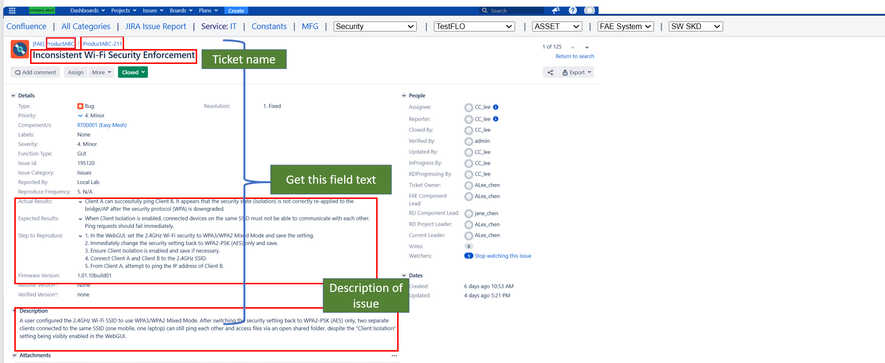
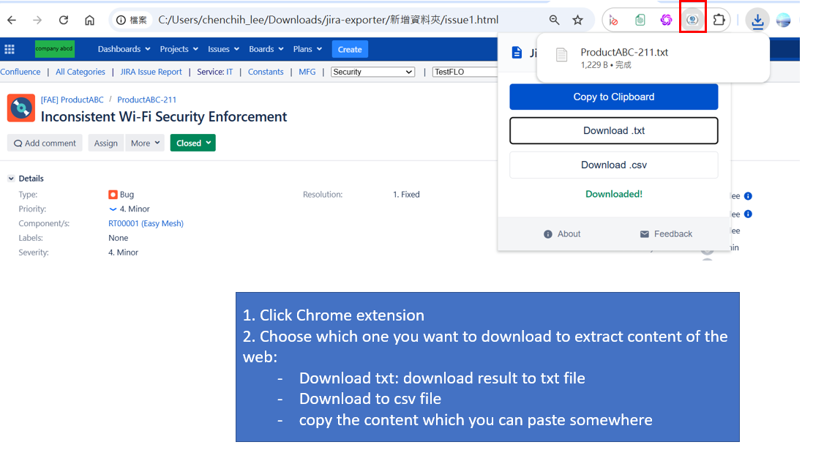
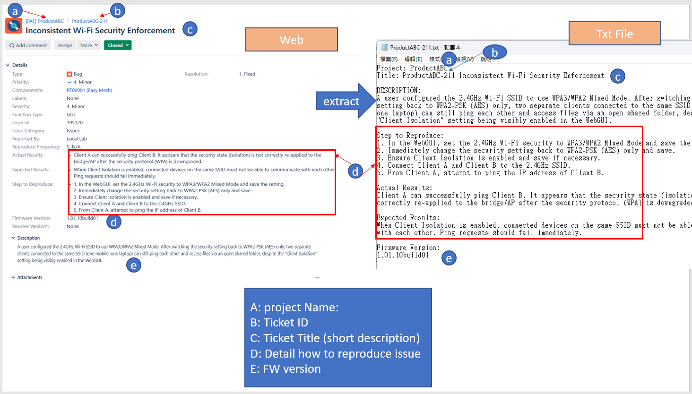

# Jira to AI Exporter 🚀

## 😫 The Pain Point
I often need to copy Jira ticket content into an LLM to help analyze the summary or debug issues. However, the main pain point is having to manually copy and paste each section (Description, Steps, Results) separately to avoid the UI clutter.

**Jira Exporter** It is a Chrome Extension designed for Developers, QA Engineers, and Product Managers that automatically removes UI clutter and formats the ticket into a clean plain text. This allow manually copying Jira tickets into AI tools (ChatGPT, Claude, etc.) to do summarize the ticket. 

---
## Update
- v1.0: inital release
- v2.0: Jiar System Update and effected title section which not able to capture, so fixed Title section
## ✨ Key Features

### 🛡️ Privacy First
*   **Auto-Redaction:** Automatically detects user mentions (e.g., `@JohnDoe`) and avatars, replacing them with `[User Redacted]`.
*   **Local Processing:** All data extraction happens entirely within your browser. No data is sent to external servers.

### 🧹 Smart Cleaning
*   **Clutter Removal:** Strips out "Show/Hide" buttons, icon text, and excessive whitespace.
*   **Compact Formatting:** Converts messy, spaced-out descriptions into clean, single-spaced text blocks optimized for LLM token usage.

### 📊 Multiple Export Formats
1.  **Clipboard:** One-click copy for instant pasting.
2.  **TXT Export:** Save a clean, readable text file backup.
3.  **CSV Export:** Vertical Key-Value format compatible with Excel.

### 🔍 Deep Extraction
Automatically captures the fields that matter most for debugging and analysis:
*   Project Name & Ticket ID
*   Title & Description
*   **Steps to Reproduce**
*   **Actual Results**
*   **Expected Results**
*   **Firmware Version**

---

## 🛠 Installation

1.  Clone this repository or download the source code folder.
2.  Open Chrome and navigate to `chrome://extensions`.
3.  Enable **Developer mode** (toggle in the top-right corner).
4.  Click **Load unpacked**.
5.  Select the folder containing the extension files.

---

## 📖 How to Use

### Step 1.  Navigate to any Jira ticket.
This is an Jiar example for demo, as you can see there are many information, and what the plugin will get are these field of data. 
- project Name
- Ticket ID
- Description of ticket
- Some step to replicate
- FW version

If you want to let AI to summarize these then you have to manually copy and paste each field. This plugin will automatic extract the text of these field

### Step 2.  Click the **Jira Exporter** icon in your Chrome toolbar.
To capture each field of content please click on Jiar exporter

### Step3  Select your desired action to download
- **Copy to Clipboard:** Best for quick AI prompting.
- **Download .txt:** Best for documentation or offline notes.
- **Download .csv:** Best for spreadsheet analysis.

When Click download will show downloaded and you can compare the Web and Text it the same. 

Now after it extract content into text file, you now can copy the entire information and paste to LLM to analysis it. 

---

## 🔒 Permissions Explained

*   `activeTab`: Required to read the content of the Jira page you are currently viewing.
*   `scripting`: Required to safely execute the cleaning algorithms on the page content.

---

## Directory Description

- result: store the downloaded file like `.txt` or `csv`
- demoJiarSample: is a demo of Jiar not the real live jiar.  

## Conclusion

Overall this tool is able to extract important ticket information into text file, and use copy the content to LLM to let AI help me analysis it without read the Jiar ticket. My example test case is an easy example also generate by AI. But in the real time the ticket somehow will seem complicated, so we might need AI support to help us. 

If you manually copy and paste it waste alot of time, click on plugin is much productive. It also faster than write a automatic webscrap script, less than a second done. 

Any question　or any recommend please reach me, but this tool is not publish on store just use for myself. If people have some feedback may I can think of publish, but for now I might not publish unless many people like it. 

## 📝 License

Distributed under the MIT License. See `LICENSE` for more information.

---